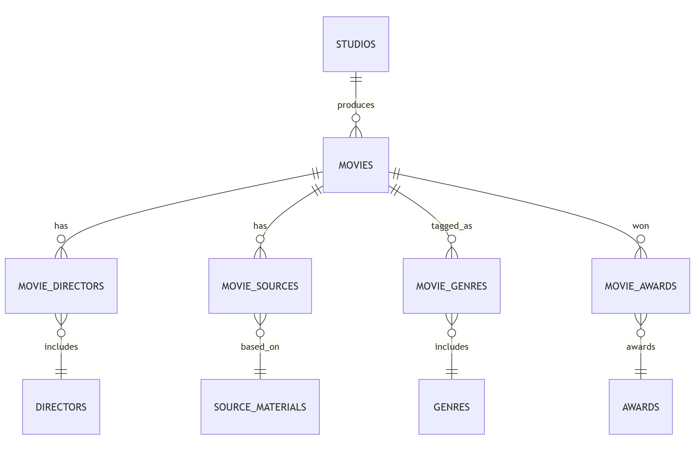

# Design Document

By Khant Thurein Zaw

Video overview: <https://youtu.be/hXLUBrPA-4o>

## Scope

The purpose of this database is to provide a comprehensive catalog of theatrically released animated films produced by Walt Disney Animation Studios, enabling users to explore and analyze the studio's historical output.

As such, included in the database's scope is:

* All theatrically released animated feature films from 1937 to 2024.
* Only films produced under Walt Disney Productions (1937–1985), Walt Disney Feature Animation (1986–2007), and Walt Disney Animation Studios (2007–present).
* Directors, genres, source materials, awards, studio information, critical reception and basic commercial information (eg., budget and box office gross)

Out of scope:
* Films produced by Pixar or other subsidiaries
* Short films, live-action remakes, adaptations and unproduced projects
* Upcoming films that have not been theatrically released yet
## Functional Requirements

This database will support:

* CRUD operations for all theatrically released films and associated data including:
    * Directors
    * Genres
    * Source Materials
    * Awards
    * Studio and release information
    * Critical reception
    * Commercial performance

In this iteration, it does not support:
* User generated ratings or audience reviews

## Representation

Entities are captured in SQLite tables with the following schema.

### Entities

Entities include the following:

### Studios

The `studios` table includes:

* `id` which specifies the unique ID for the studio as an `INTEGER`. This column thus has the `PRIMARY KEY` constraint applied.
* `name` which specifies the studio name as `TEXT`, given that the datatype is appropriate for names. A `UNIQUE` constrainst is applied so that no duplicate studio names exist.
* `founded` which specifies the year at which the studio was founded as an `INTEGER`. This column is marked as `NOT NULL` since all studios have a year at which they were founded.
* `ended` which specifies the year at which the studio was ended as an `INTEGER`.

All columns except `ended` are required and hence have the `NOT NULL` constraint applied where a `PRIMARY KEY` or `FOREIGN KEY` constraint is not. The `founded` column also has a `CHECK` constrainst applied to make sure that the value is a positive number.

### Directors

The `directors` table includes:

* `id` which specifies the unique ID for the director as an `INTEGER`. This column has the `PRIMARY KEY` constraint applied.
* `first_name` which specifies the director's first name as `TEXT`.
* `last_name` which specifies the director's last name as `TEXT`.

All columns required and hence have the `NOT NULL` constraint applied where a `PRIMARY KEY` or `FOREIGN KEY` constraint is not.

### Movies

The `movies` table includes:

* `id` which specifies the unique ID for the movie as an `INTEGER`. This column has the `PRIMARY KEY` constraint applied.
* `name` which specifies the movie's name as `TEXT`, given that the datatype is appropriate for names. A `UNIQUE` constrainst is applied so that no duplicate movie names exist.
* `release_date` which is the date at which the movie was released as the type `NUMERIC` which is the most appropriate for storing dates in the YYYY-MM-DD format.
* `runtime_minutes` which is the duration of the movie in minutes which is stored as an `INTEGER`.
* `budget_millions` is the estimated budget of the movie in millions of dollars which is stored as `NUMERIC`. This column is optional as some movies have unknown budgets.
* `box_office_millions` is the worldwide box office gross in millions of dollars, stored as `NUMERIC`. This column is optional.
* `studio_id` which is the ID of the studio that produced the film as an `INTEGER`. This column thus has the `FOREIGN KEY` constraint applied, referencing the `id` column in the `studios` table to ensure data integrity.
* `rotten_tomatoes_score` is the score given by Rotton Tomatoes stored as an `NUMERIC`. This column is optional.
* `cinemascore` is the CinemaScore rating as `TEXT`. This column is optional.

All columns except `budget_millions`, `box_office_millions`, `rotten_tomatoes_score` and `cinemascore` are required and hence have the `NOT NULL` constraint applied where a `PRIMARY KEY` or `FOREIGN KEY` constraint is not. A `CHECK` constraint is applied to `rotten_tomatoes_score` to ensure that the value is between 0 and 100 inclusive.

### Source_Materials

The `source_material` table includes:

* `id` which specifies the unique ID for the source material as an `INTEGER`. This column has the `PRIMARY KEY` constraint applied.
* `name` which specifies the name of the source material as `TEXT`.
* `creator` which specifies the type of creator.

All columns required and hence have the `NOT NULL` constraint applied where a `PRIMARY KEY` or `FOREIGN KEY` constraint is not.

### Genres

The `genres` table includes:

* `id` which specifies the unique ID for the genre as an `INTEGER`. This column has the `PRIMARY KEY` constraint applied.
* `name` which specifies the name of the genre as `TEXT`. A `UNIQUE` constraint ensures that no duplicate genres exist.

All columns required and hence have the `NOT NULL` constraint applied where a `PRIMARY KEY` or `FOREIGN KEY` constraint is not.

### Awards

The `awards` table includes:

* `id` as `INTEGER` which specifies the unique ID for the award. This column has the `PRIMARY KEY` constraint applied.
* `name` as `TEXT` for the name of the award with a `UNIQUE` constraint applied to avoid duplicates.

All columns required and hence have the `NOT NULL` constraint applied where a `PRIMARY KEY` or `FOREIGN KEY` constraint is not.

### Movie_Directors

The `movie_directors` table includes:

* `movie_id` which is a `FOREIGN KEY` referencing the `id` column from the `movies` table.
* `director_id` which is a `FOREIGN KEY` referencing the `id` column from the `directors` table.

All fields are `NOT NULL` and the `PRIMARY KEY` is the combination of `movie_id` and `director_id` to ensure uniqueness.

### Movie_Genres

The `movie_genres` table includes:

* `movie_id` which is a `FOREIGN KEY` referencing the `id` column from the `movies` table.
* `genre_id` which is a `FOREIGN KEY` referencing the `id` column from the `genres` table.

All fields are `NOT NULL` and the `PRIMARY KEY` is the combination of `movie_id` and `genre_id` to ensure uniqueness.

### Movie_Sources

The `movie_sources` table includes:

* `movie_id` which is a `FOREIGN KEY` referencing the `id` column from the `movies` table.
* `source_id` which is a `FOREIGN KEY` referencing the `id` column from the `source_materials` table.

All fields are `NOT NULL` and the `PRIMARY KEY` is the combination of `movie_id` and `source_id` to ensure uniqueness.

### Movie_Awards

The `movie_awards` table includes:

* `id` as `INTEGER` which specifies the unique ID for the row. This column has the `PRIMARY KEY` constraint applied.
* `movie_id` which is a `FOREIGN KEY` referencing the `id` column from the `movies` table.
* `award_id` which is a `FOREIGN KEY` referencing the `id` column from the `awards` table.
* `type` is whether the award was nominated or won as `TEXT`.

All fields are `NOT NULL` and the `PRIMARY KEY` is the combination of `movie_id`, `award_id` and `year` to ensure uniqueness. A `CHECK` constraint is applied to the `type` column so that the accepted values are only nominated or won.

### Relationships

The below entity relationship diagram describes the relationships among the entities in the database.

As detailed by the diagram:

* One movie is produced by only one studio. A studio can produce zero or many movies.
* One movie is directed by at least one or many directors. One director directs at least one or many movies.
* One movie has zero or multiple source materials. One source material has at least one or many movies.
* One movie has at least or many genres. One genre can have zero or many movies.
* One movie can have zero or multiple awards. One award can be given to zero or many movies.

## Optimizations

Indexes were created on foreign key columns across all junction and related tables (`movie_directors`, `movie_genres`, `movie_sources`, `movie_awards` and `movies`(`studio_id`)) to boost query performance.

In addition, as per the queries in `queries.sql`, indexes were created on:

* `last_name` and `first_name` of the `directors` table to improve search speed when searching by directors.
* `movies`(`release_date`) and `movies`(`box_office_millions` DESC) to support sorting by release date or box office gross.
* `movies`(`name`) and `source_materials`(`name`) to allow fast lookups by movie title or source material.
* `movie_awards`(`type`) to optimize queries filtering by award status (e.g., won vs. nominated).

## Limitations

The current schema assumes that each movie is linked to only one studio, making co-productions impossible to model. There are no relationships between sequels or reboots so it is hard to track them. This schema also does not track changes over time such as releases or updating box office numbers.
