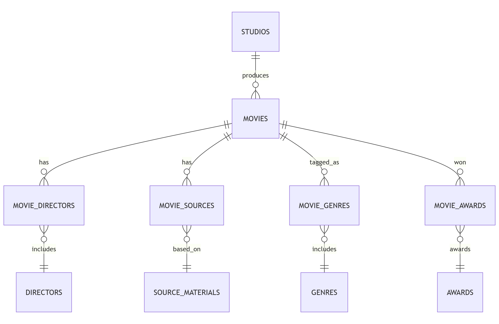

# Disney Animation Films Database 

[](https://sqlite.org)
[](https://cs50.harvard.edu/sql)



A comprehensive SQL database cataloging all theatrically released animated films from Walt Disney Animation Studios (1937-2024), including directors, genres, awards, and commercial performance metrics.

## Video Overview
[](https://youtu.be/hXLUBrPA-4o)

## Database Schema
```
├── csv_files/              # Original data files
├── DESIGN.md               # Full project specifications
├── README.md
├── diagram.png             # Entity-relationship model
├── disney.db               # SQLite database
├── import_data.txt         # Data import instructions
├── queries.sql             # 15+ analytical queries
└── schema.sql              # Complete schema definition
```


## Key Features
- **Complete filmography** of 61 Disney Animation features (1937-2024)
- Tracks **directors, genres, source materials, awards**, and **commercial performance**
- Optimized with **strategic indexes** for fast querying
- Includes **15+ sample queries** for business intelligence
- Clear **entity-relationship model** (see diagram.png)

## Sample Insights
```sql
-- Highest grossing Disney directors
SELECT d.first_name, d.last_name, 
       SUM(m.box_office_millions) AS total_gross
FROM directors d
JOIN movie_directors md ON d.id = md.director_id
JOIN movies m ON md.movie_id = m.id
GROUP BY d.id
ORDER BY total_gross DESC
LIMIT 5;
```

## Technical Implementation
Database Schema Highlights
- 7 main tables with proper normalization
- 4 junction tables for many-to-many relationships
- Constraints ensuring data integrity:
```sql
CHECK (rotten_tomatoes_score BETWEEN 0 AND 100)
CHECK (type IN ('nominated', 'won'))
```

## Performance Optimizations
- Indexes on all foreign keys
- Specialized indexes for:
- Director name searches
- Box office ranking
- Award status filtering

## Scope Details
| Scope                | Status    | Details                          |
|----------------------|-----------|----------------------------------|
| Theatrical Films     | ✅ Included | 1937-2024 WDAS productions     |
| Production Data      | ✅ Included | Directors, genres, budgets     |
| Subsidiary Films     | ❌ Excluded | Pixar/Disneytoon Studios       |
| Audience Metrics     | ❌ Excluded | User ratings, social media data|

## Credits
- **Data Sources**:
  - Film metadata from [Wikipedia's WDAS films table](https://en.wikipedia.org/wiki/List_of_Walt_Disney_Animation_Studios_films)
  - Box office data from [Box Office Mojo](https://www.boxofficemojo.com/)
- **Developer**: Khant Thurein Zaw | CS50 SQL Final Project